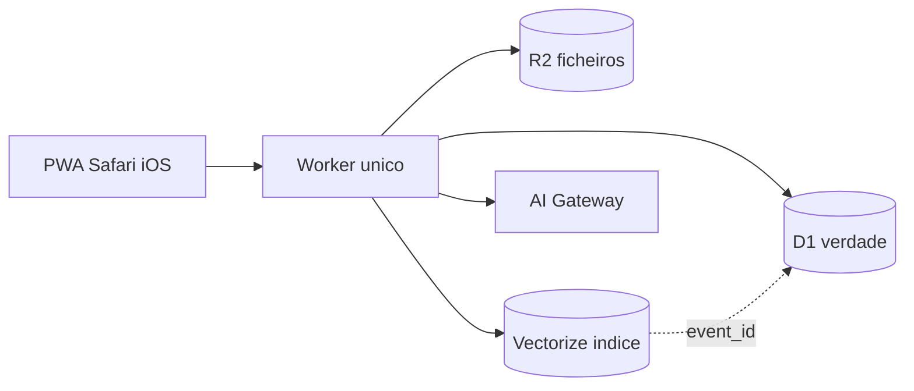
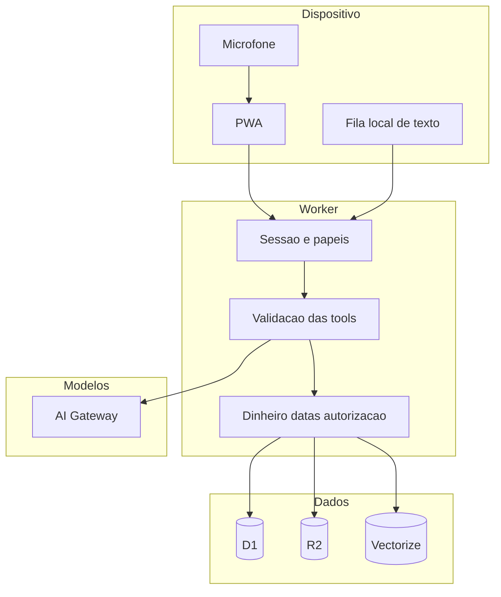
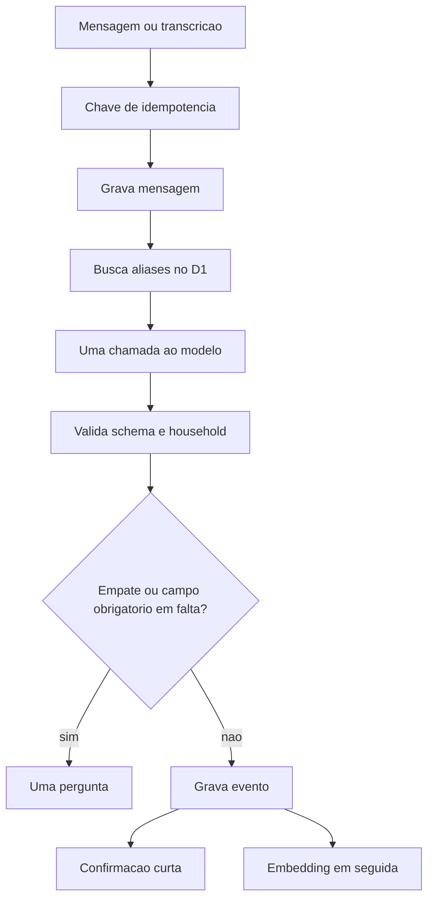
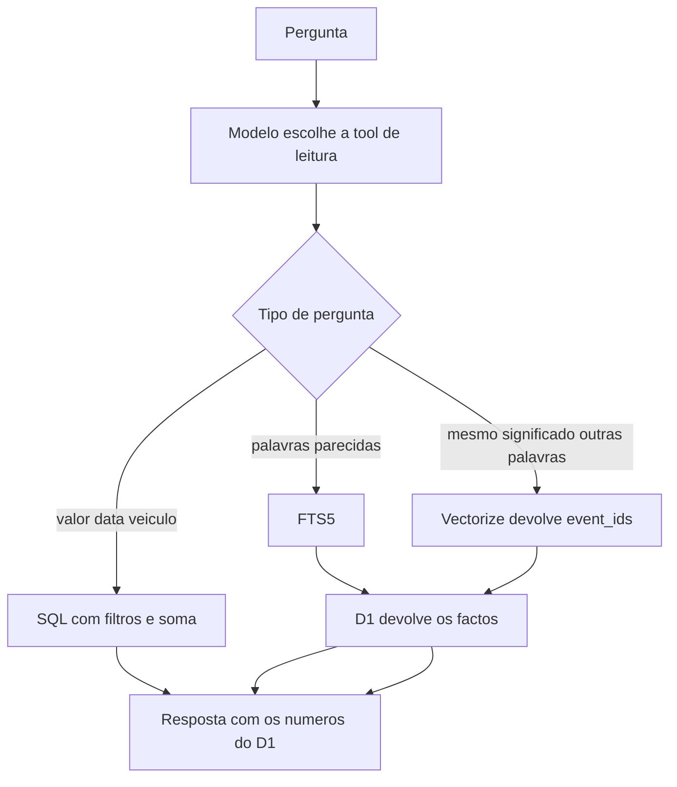
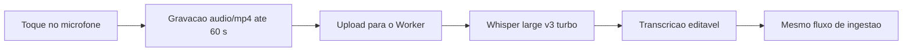
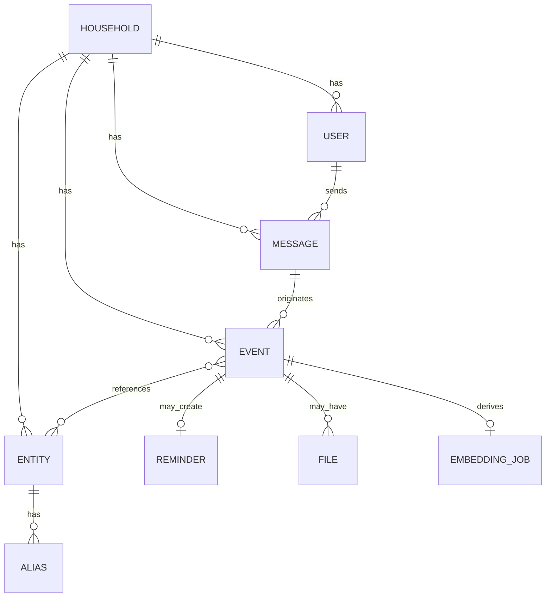
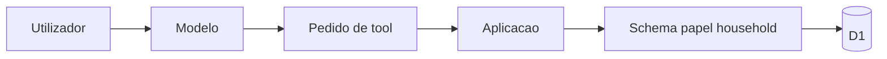

# AgenteTobias — Arquitetura

Data: 5 de outubro de 2026.

Este documento planeia o AgenteTobias. Não implementa a aplicação.

O AgenteTobias é uma aplicação determinística de memória familiar, com uma interface conversacional. O modelo de linguagem interpreta frases e voz. O sistema guarda os factos, autoriza, calcula e responde com os dados reais da casa.

## 1. Executive Summary

A arquitetura recomendada é uma PWA (Vite + React), servida pelo mesmo Cloudflare Worker que expõe a API. D1 é a fonte de verdade. R2 guarda ficheiros. Vectorize é um índice reconstruível, nunca a fonte dos números. Um único modelo pequeno, atrás do AI Gateway, traduz cada mensagem em tool calls validadas pela aplicação.

Uma pessoa consegue desenvolver, operar e perceber este sistema. Há um deployable, uma base de dados e uma chamada de modelo por mensagem.

Questão central: a forma serverless mais simples, barata, rápida e segura de transformar linguagem natural e voz numa memória familiar consultável é este Worker único, com factos estruturados em D1 e IA apenas na interpretação.

## 2. Assumptions

Assunções usadas nesta proposta. Cada uma pode ser revista sem mudar o desenho de fundo.

- Uma família, cerca de cinco pessoas, em Portugal. O modelo de dados admite mais do que um household desde o início, para o isolamento não ser um remendo.
- Idioma de uso: português europeu e português do Brasil. Código, tabelas e tools em inglês. Fuso `Europe/Lisbon`. Moeda `EUR`.
- Uso esperado: 100 a 1.000 mensagens por dia no teto familiar, não um SaaS público.
- A app corre com a casa inteira desligada. Nada depende de um computador, NAS ou Raspberry Pi.
- O domínio é `https://tobias.timdevops.com.br`. Passkeys e a PWA usam este host.
- “JEV”, no pedido de planeamento, significa um classificador pequeno e dedicado, separado do modelo principal. Não há um produto com esse nome a integrar.
- O candidato de modelo (`@cf/qwen/qwen3-30b-a3b-fp8`) e o Whisper (`@cf/openai/whisper-large-v3-turbo`) só ficam definitivos depois de um conjunto de avaliação em português. A interface de provedor torna a troca uma configuração.
- Preços e limites abaixo foram lidos na documentação Cloudflare e na página de preços da OpenAI em 5 de outubro de 2026. Mudam. A secção 13 cita as fontes.
- A página de preços dos Workers (atualizada a 7 de julho de 2026) diz que o Vectorize está disponível no plano Workers Paid e, na mesma tabela, lista um plafond no plano Free. Até a conta confirmar o contrário, o índice semântico trata-se como capacidade do plano pago. O protótipo não depende dele.

## 3. Functional Requirements

Prioridade: o que permite registar um facto em poucos segundos e consultá-lo depois.

### P0 — Prototype

- Um household, membros, sessão.
- Chat de texto.
- Registo de despesa e de abastecimento, com entidade (loja ou veículo).
- Confirmação curta, editar e desfazer.
- Consulta estruturada: soma e última ocorrência.
- Mensagem original conservada e ligada ao facto.

### P1 — MVP

- Voz: gravar, transcrever, editar a transcrição, interpretar.
- Aliases (“i30”, “meu carro”).
- Compra com garantia. A data de fim é calculada em código.
- Lembretes visíveis na aplicação.
- Anexo (foto, PDF) no R2, com metadata no D1.
- Pesquisa lexical (FTS5).
- Passkeys nos telemóveis e portáteis.
- Tablet partilhado: escolha de membro, PIN, timeout, memórias privadas ocultas.
- Embedding assíncrono do evento, para a busca semântica da V1 não exigir migração.

### P2 — V1

- Busca semântica: a pergunta encontra o evento mesmo sem as mesmas palavras.
- Exportação do household (JSON + ZIP dos ficheiros).
- Memórias `adults` e `private` com regras fechadas.
- Sugestão de sítio a partir de locais já guardados, no momento do envio.
- Web Push para lembretes, com a PWA instalada.

### P3 — V2 e depois

- V2: aviso aos adultos quando uma garantia entra nos 30 dias.
- Mais tarde: OCR, aplicação nativa, banco, casa inteligente, geofencing, dashboards contabilísticos.

Fora de âmbito até lá: Open Banking, Home Assistant, IoT, reconhecimento contínuo de localização, recibos em massa, integração com supermercados ou carros.

## 4. Non-functional Requirements

| Área | Meta |
| --- | --- |
| Disponibilidade | A da Cloudflare. Um registo tem de poder ficar guardado mesmo com o modelo ou o Vectorize em baixo. |
| Latência, shell | Primeiro ecrã útil abaixo de 1,5 s em 4G. |
| Latência, texto | Confirmação abaixo de 3 s no percentil 95, com uma ida ao modelo. |
| Latência, consulta | Soma ou última ocorrência abaixo de 400 ms, cálculo em SQL. |
| Latência, voz | Transcrição de um áudio curto abaixo de 5 s depois de soltar o botão. |
| Segurança | Isolamento por household em todas as queries. Tools com schema. Chaves de API só no Worker. |
| Privacidade | Minimização. Sem rasto contínuo. Sem texto familiar em logs. |
| Custo | $0 enquanto couber no plano Free. Teto esperado de $5 a $8 por mês no uso familiar intenso. |
| Manutenção | Uma pessoa. Um repositório. Um Worker. |
| Observabilidade | `trace_id`, latência, modelo, tokens, tool, duração de STT. Sem corpo do prompt. |
| Recuperação | Time Travel do D1 (7 dias no Free, 30 no Paid) e export semanal para R2. RPO de 7 dias no pior caso do export; RTO de horas. |
| Portabilidade | SQL e export JSON/ZIP. Embeddings reconstruíveis a partir do D1. |

## 5. Proposed Architecture



Um Cloudflare Worker serve os assets da PWA e a API. O browser fala só com esse Worker. O Worker fala com D1, R2, Vectorize e com o AI Gateway. O cliente nunca vê chaves de modelo, SQL ou URLs permanentes de objetos.

Componentes que entram:

- PWA instalável no ecrã principal do iPhone, iPad e Mac.
- Worker com static assets.
- D1.
- R2, quando há anexo.
- AI Gateway, com o núcleo gratuito (métricas, limite, cache, BYOK).
- Workers AI para o modelo de interpretação, o Whisper e o embedding.
- Vectorize a partir do momento em que a conta está no plano que o disponibiliza.

Componentes que ficam de fora: Pages separado, Queues, Workflows, Durable Objects, KV, Redis, Kubernetes, Kafka, Elasticsearch, um segundo banco, um classificador JEV.

### Fronteiras de confiança



O dispositivo é não confiável. O Worker é a única fronteira que autoriza. O modelo é não confiável: propõe tool calls, não executa efeitos. Conteúdo de PDF e de transcrição é dados, não instruções.

### Ingestão



### Consulta



A soma, a data de garantia e a última manutenção não saem do texto do modelo. Saem de colunas e de código.

### STT



### Modelo de dados



### LLM e tools



## 6. Alternative Architectures

### A. Plano Free, sem vetores, como desenho final

O protótipo vive aqui: FTS5, sem Vectorize, sem pagar os $5. Como arquitetura de anos, falha em três tetos do plano Free: 10 ms de CPU por invocação, 500 MB por base D1, e 10.000 neurónios por dia (acima disso a inferência pára até à meia-noite UTC). Um domingo cheio deixa de interpretar. Serve como fase, não como destino.

### B. Supabase ou Neon, mais um LLM externo

Postgres gerido, autenticação incluída e storage de ficheiros. Para cinco pessoas acrescenta outra conta, outros segredos e outro sítio onde a família está. O encaixe com a preferência Cloudflare piora. A portabilidade de SQL já se obtém com o D1 e com o export. Fica de fora.

### C. Classificador pequeno e, a seguir, um modelo grande

É o desenho que o pedido chama de JEV: classificar barato e só então chamar um modelo capaz. Com um modelo pequeno que já devolve JSON e tool calls, a segunda etapa aumenta latência e pontos de falha para poupar cêntimos. No pico familiar estimado, o modelo custa cerca de $3 por mês. A pipeline não se paga. Um segundo provedor existe só como fallback, uma tentativa, nunca em série em cada mensagem.

## 7. Data Model

Proposta inicial. Campos a mais ficam para quando uma query real os exigir.

### households

- Obrigatório: `id`, `name`, `timezone` (default `Europe/Lisbon`), `currency` (default `EUR`), `locale` (default `pt-PT`).
- Opcional: `created_at`.

### users

- Obrigatório: `id`, `household_id`, `display_name`, `role` (`owner | adult | member | child`).
- Opcional: `pin_hash` (só no tablet), `created_at`.
- Um utilizador pertence a um household nesta fase. Um convite cria o membro; não há diretório global.

### sessions e passkeys

- `passkeys`: `id`, `user_id`, `credential_id`, `public_key`, `sign_count`.
- `sessions`: `id`, `user_id`, `device_id`, `expires_at`, `revoked_at`.
- `devices`: `id`, `household_id`, `kind` (`personal | kiosk`), `name`.

### messages

Imutável.

- Obrigatório: `id`, `household_id`, `actor_id`, `client_message_id`, `text`, `created_at`, `source` (`text | voice`).
- Opcional: `device_id`, `audio_object_key` (apagado depois da transcrição, se a família não quiser guardar voz), `status` (`stored | interpreted | failed`).
- Único: `(household_id, client_message_id)`.

### events

O facto.

- Obrigatório: `id`, `household_id`, `message_id`, `actor_id`, `type`, `occurred_at`, `visibility` (`household | adults | private`), `status` (`active | voided | superseded`), `version`.
- Indexados e opcionais conforme o tipo: `amount_minor` (inteiro, cêntimos), `currency`, `entity_id` principal.
- JSON `data` para o resto (litros, km, meses de garantia, notas).
- `supersedes_event_id` quando é uma correção.

Tipos iniciais, validados por schema, sem tabela própria: `expense`, `purchase`, `vehicle.fuel`, `vehicle.maintenance`, `warranty`, `object.location`, `note`, `incident`, `reminder`.

### entities e aliases

- `entities`: `id`, `household_id`, `kind` (`vehicle | merchant | appliance | place | person | pet | document | other`), `name`, `status`.
- Opcional em `data`: atributos estáveis (matrícula, morada aproximada já confirmada).
- `aliases`: `entity_id`, `household_id`, `normalized` (minúsculas, sem acentos supérfluos). Único por household.

### event_entities

- `event_id`, `entity_id`, `role` (`vehicle | merchant | subject | place`).

### reminders

- `id`, `household_id`, `event_id` opcional, `due_at`, `audience` (`adults | household`), `status`.

### files

- `id`, `household_id`, `event_id`, `r2_key`, `mime`, `bytes`, `sha256`, `created_by`.
- O binário não entra no D1.

### embedding_jobs

- `event_id`, `status` (`pending | ready | failed`), `vector_id`, `embedded_text_hash`.
- Permite reindexar e apagar o vetor quando o evento muda.

### Índices

- `events (household_id, type, occurred_at)`
- `events (household_id, amount_minor, occurred_at)` onde `amount_minor` não é nulo
- `events (household_id, status, visibility)`
- `aliases (household_id, normalized)`
- `messages (household_id, client_message_id)` único
- FTS5 sobre o texto canónico do evento (mensagem original mais uma linha montada dos campos)

JSON fica para o que não se soma nem se filtra no dia a dia. O que se soma (`amount_minor`) é coluna.

Volume em cinco anos, a cerca de 2 KB por evento com índices: ~365 MB a 100 mensagens por dia (perto do teto de 500 MB do D1 no Free); ~3,6 GB a 1.000 por dia (cabe nos 10 GB do D1 no Paid).

## 8. Event Model

Ciclo:

```text
texto ou voz
  → message (imutável)
  → interpretação (saída do modelo, versionada, auditável)
  → event (facto)
  → texto canónico
  → embedding opcional
```

Uma frase pode gerar mais do que um facto. “Levei o i30 à oficina, pastilhas, 180 euros” produz um evento `vehicle.maintenance` com `amount_minor = 18000`, ligado à entidade do i30. Não há quatro tabelas para a mesma frase.

Corrigir: o evento antigo passa a `superseded`, nasce outro com `version + 1` e o mesmo `message_id` de origem, ou com uma mensagem nova de correção. O embedding antigo é apagado e o novo fica `pending`.

Desfazer: `status = voided`. A mensagem fica. O vetor sai. O ficheiro sai se deixou de ter evento ativo.

Reprocessar: a mensagem original continua lá. Corre-se outra interpretação. Os factos derivados regeneram-se. Os embeddings também.

Idempotência: o cliente gera `client_message_id` (UUID) antes do envio. Retry, refresh e a fila offline reenviam o mesmo id. O único na base impede o segundo abastecimento de €70.

O que é determinístico, sempre em código:

- autorização e household;
- cêntimos e moeda;
- “hoje”, “ontem”, “sábado” no fuso do household;
- fim de garantia = data de compra mais os meses;
- somas e intervalos;
- anulação e versão.

O que é probabilístico, sempre revisto pela validação:

- intenção e tipo;
- qual entidade;
- extração de números a partir do texto;
- escolha da tool de leitura;
- vizinhança semântica.

O modelo pode propor `warranty_months = 24`. A data de fim não é um campo que o modelo inventa.

## 9. AI Architecture

### Routing

```text
mensagem
  ├─ já é uma resposta a uma pergunta pendente da conversa
  │     └─ continua o turno, uma chamada
  └─ caso geral
        └─ um modelo pequeno com tool calling
              ├─ sucesso → a aplicação executa
              └─ falha de provedor → uma tentativa no fallback, depois fila
```

Não há ramo “regex de intenções” nem ramo “modelo grande se a frase for difícil”. Todas as mensagens novas que precisam de interpretação fazem uma chamada. Consultas cuja tool já devolveu linhas não fazem uma segunda chamada para “reescrever a soma”: o texto da resposta usa os números devolvidos pela query.

### Provedor

Interface `AIProvider` com operações `interpret`, `transcribe`, `embed`. Implementações: `WorkersAIProvider` e, quando o eval o exigir, `OpenAIProvider` ou outro via AI Gateway BYOK. O id do modelo é configuração (`AI_INTERPRET_MODEL`), não um import espalhado.

Candidato inicial: `@cf/qwen/qwen3-30b-a3b-fp8`. Function calling, janela de 32.768 tokens, preço de tabela $0.051 por milhão de tokens de entrada e $0.335 por milhão de saída. Barato o suficiente para ser o único passo.

Fallback: um modelo externo barato, uma tentativa, timeout na ordem dos 8 s. Sem terceira tentativa. Sem chamar um modelo mais caro “por segurança” em automático.

AI Gateway no meio: as chaves ficam no Worker ou no BYOK do gateway. Cache só para pedidos idênticos e não sensíveis; o default é cache desligada em interpretação familiar, porque duas frases iguais em dias diferentes são factos diferentes. Limite de taxa por household, para um ciclo acidental não esgotar o dia.

### Contexto enviado ao modelo

Orçamento curto, montado em código:

- instrução fixa e pequena;
- moeda, fuso, papel de quem fala;
- a mensagem atual;
- as últimas voltas desta conversa (texto, poucas);
- até cerca de 15 entidades cujo alias aparece na frase, ou as entidades recentes do mesmo tipo.

Fora do prompt: histórico da família, documentos inteiros, coordenadas, eventos de outro household, memórias `private` de outra pessoa, memórias `adults` se quem fala é `child`.

### Tools

Poucas, de propósito. O tipo do facto viaja nos dados.

| Tool | Efeito |
| --- | --- |
| `record_event` | Cria facto se o schema do `type` passar |
| `resolve_or_create_entity` | Liga a um alias existente ou propõe entidade nova |
| `ask_clarification` | Uma pergunta, zero escritas |
| `search_events` | Filtros (tipo, entidade, intervalo, montante) |
| `search_text` | FTS5 e, se existir, vetores; hidrata no D1 |
| `correct_event` | Nova versão |
| `void_event` | Anula |
| `create_reminder` | Lembrete ligado ou não a um evento |
| `attach_file` | Liga metadata de um objeto já enviado |

Cada tool tem schema Zod, verificação de papel, `household_id` imposto pelo servidor (o modelo não escolhe o household), e erro explícito. `record_event` de `expense` exige `amount_minor` e `currency`. `vehicle.fuel` exige uma entidade veículo resolvida. Campos opcionais (litros, posto, km, método de pagamento) podem faltar.

Criar entidade: se o alias normalizado já existe, a tool recusa a duplicação e devolve o id existente. Se dois veículos casam com “o carro”, a tool de escrita não corre; corre `ask_clarification`.

### Confiança

Sem pontuação falsa.

- Schema válido e uma entidade: pergunta antes de gravar. “Entendi: €70 de combustível no i30. Gravo?” Gravar e Não, ou “sim” / “não” na frase seguinte, sem segunda chamada ao modelo. Depois de gravado, Editar e Desfazer.
- Schema válido e buracos opcionais: a mesma pergunta. Não se pergunta o posto.
- Campo obrigatório em falta, ou duas entidades possíveis: uma pergunta. “Foi o i30 ou o Aveo?” Sem proposta.
- Data e hora: o relógio de Lisboa responde. O modelo não inventa o dia.

### Avaliação de modelos

Conjunto próprio, cerca de 50 frases reais da casa, corrido quando se muda de modelo. Mede: tipo, entidades, valores (70, 70,50, “70 conto”, “dezoito mil quatrocentos e cinquenta”), tool, alucinação de entidade, pergunta a mais, pergunta em falta. PT-PT e PT-BR (geladeira/frigorífico, celular/telemóvel). O critério de troca é este conjunto, não um ranking público.

Latência, custo por mensagem e fiabilidade do provedor entram na mesma ficha. Privacidade: preferir o caminho em que o texto não fica em log de terceiro. Workers AI e AI Gateway com corpo de pedido desligado cumprem isso melhor do que um provedor com retenção opaca.

## 10. STT Architecture

A voz é de primeira classe. O desenho é gravar e enviar, não streaming.

No Safari iOS o `MediaRecorder` produz `audio/mp4`. O Whisper na Cloudflare aceita esse contentor. Teto de 60 segundos. Abaixo de cerca de 0,4 s, descarta-se. A pessoa vê a transcrição e pode corrigir “setenta” ou “18450” antes da interpretação.

Modelo: `@cf/openai/whisper-large-v3-turbo`, $0.0005 por minuto de áudio, 46,63 neurónios por minuto. Multilingue, inclui português.

Fallback de produto, só se o conjunto de avaliação falhar em números, PT-PT, nomes de lojas ou modelos de carro: `gpt-4o-mini-transcribe` da OpenAI, cerca de $0.003 por minuto, via AI Gateway BYOK. Não se transcreve duas vezes por defeito.

Ficam de fora:

- Web Speech API. No iOS a qualidade e a disponibilidade oscilam, e o áudio sai do nosso controlo.
- Whisper no telemóvel. Peso, bateria e qualidade em PT-PT não servem o “tap e pronto”.
- Streaming. Mais estados, mais custo por minuto em alguns provedores, ganho pequeno para frases de dez segundos.

Custo e ruído: duração máxima, paragem explícita, não reenviar o mesmo áudio (o `client_message_id` cobre o retry), não guardar o áudio depois da transcrição aceite. Detecção de silêncio no cliente pode entrar quando a medição mostrar desperdício; não é pré-requisito.

O áudio passa pelo Worker e segue para o Workers AI. Não há segundo armazenamento permanente da voz no MVP.

## 11. Vector Strategy

O Vectorize responde a “quando foi aquele problema da geladeira?” quando o texto guardado diz “frigorífico”. O FTS5 e os aliases cobrem o resto, incluindo “Continente” e “i30”.

O que se embute: um texto canónico por evento. Frase original mais uma linha montada em código a partir dos campos (“expense 8370 EUR Continente 2026-10-05”). Sem segundo modelo para resumir. Sem embutir cada campo, cada anexo ou cada turno de conversa.

Modelo: `@cf/baai/bge-m3`, multilingue, $0.012 por milhão de tokens, 1.075 neurónios por milhão. Dimensão a fixar pela ficha do modelo no dia da implementação (o índice não mistura dimensões; a referência pública do bge-m3 é 1024). Metadata: `household_id`, `visibility`, `event_id`.

Quando: `waitUntil` depois do commit do evento. Um cron horário apanha `embedding_status = pending`. Falha do Vectorize não falha o registo.

Consulta: filtro de metadata pelo household e pela visibilidade de quem pergunta, ids de volta, factos lidos no D1. Se o Vectorize estiver em baixo, a pergunta cai para FTS5 e a resposta diz o que encontrou por texto.

Apagar ou corrigir: apagar o vetor pelo `event_id` e voltar a marcar `pending` se ainda houver facto ativo.

Reindexação: percorrer eventos ativos e reembutir. O D1 chega para reconstruir o índice do zero.

No plano Free a página de preços lista 5 milhões de dimensões guardadas (cerca de 4,8 mil vetores a 1024 dimensões) e, ao mesmo tempo, indica que o Vectorize está no plano Paid. O protótipo usa só FTS5. O embedding do MVP liga-se quando a conta o permitir. Mesmo com anos de histórico, o armazenamento do índice fica na ordem de cêntimos a cerca de um dólar por mês no plano pago (secção 13).

## 12. Security & Privacy

Dados em causa: dinheiro, rotina, documentos, veículos, escola, casa, sítios, crianças.

### Controlos

- Sessão em cookie `HttpOnly`, `Secure`, `SameSite`. Passkey para dispositivos pessoais. Revogação apaga a sessão.
- Tablet kiosk: o owner regista o aparelho. O ecrã mostra os membros. O PIN (hash com segredo de servidor) escolhe a sessão curta. Timeout devolve ao ecrã de escolha. Conteúdo `private` e `adults` não aparece a `child` nem a sessão de membro sem esse papel.
- Papéis: `owner`, `adult`, `member`, `child`. Chega. Não há RBAC corporativo.
- Toda a query e todo o objeto R2 levam `household_id` e o papel, no servidor. Ids adivinhados de outro household devolvem ausência, não “proibido” que confirme existência.
- URLs de ficheiro são temporárias, emitidas depois da verificação. O bucket não é público.
- Upload: teto 10 MB no MVP, tipos `image/jpeg`, `image/png`, `image/webp`, `application/pdf`. Sem execução. O texto extraído de um PDF, se um dia existir, entra como dados entre delimitadores, sem ferramentas extra por causa do conteúdo.
- CSP restritiva. Segredos em Workers Secrets, distintos por ambiente.
- Localização só no envio, com permissão. Comparação com sítios já gravados pela família (raio curto). Guarda-se o nome confirmado. As coordenadas não ficam na base. Sem geocoder de terceiros. Sem seguimento contínuo.
- Logs: metadados. O corpo do prompt e a transcrição não vão para o AI Gateway nem para o log do Worker. O registo de erros leva `trace_id`, `event_id`, código, não o texto.
- Exportação futura é um `SELECT` do household mais os objetos R2. Quem exporta é o `owner`.

### Threat model

| Ameaça | O que se faz |
| --- | --- |
| Conta ou sessão roubada | Passkey, sessão revogável, timeout no tablet. O owner remove o membro e as sessões. |
| Telemóvel perdido | Revogar sessões desse dispositivo. O PIN do tablet não abre o telemóvel pessoal. |
| Acesso entre households | `household_id` em todas as queries e no filtro do vetor. Teste de IDOR no conjunto de integração. |
| Chave de API no cliente ou no git | Chaves só em secrets. O browser fala com o Worker. |
| Ficheiro malicioso | Tipo e tamanho. Sem abrir no servidor com parser exótico no MVP. PDF tratado como opaco. |
| Injeção de prompt, direta ou via documento | O modelo não tem SQL, não escolhe household, não eleva papel. Escrita só pelos schemas. Uma tool não ganha permissões por texto. |
| Abuso de tools e parâmetros alucinados | Validação. Alias existente bloqueia entidade duplicada. Ações destrutivas (`void_event`) exigem o id de um evento deste household e ficam no histórico. |
| Objeto R2 exposto | Bucket privado, URL curta, prefixo `household_id/`. |
| Enumeração e força bruta | Respostas uniformes. Limite no PIN do tablet e no início de sessão. |
| Fuga de localização | Coordenadas efémeras. Persistência só do sítio confirmado. |
| Logs e AI Gateway | Corpo desligado. Métrica sem texto. |

Prioridade real, por ordem: fuga entre households, prompt a levar o modelo a escrever o facto errado ou no sítio errado, PIN curto no tablet da sala, e logs a guardarem a vida da família.

## 13. Cost Analysis

Fontes lidas em 5 de outubro de 2026:

- [Workers pricing](https://developers.cloudflare.com/workers/platform/pricing/) (página com data de 7 de julho de 2026)
- [D1 pricing](https://developers.cloudflare.com/d1/platform/pricing/) e [D1 limits](https://developers.cloudflare.com/d1/platform/limits/)
- [R2 pricing](https://developers.cloudflare.com/r2/pricing/)
- [Vectorize pricing](https://developers.cloudflare.com/vectorize/platform/pricing/)
- [Workers AI pricing](https://developers.cloudflare.com/workers-ai/platform/pricing/)
- [AI Gateway pricing](https://developers.cloudflare.com/ai-gateway/reference/pricing/)
- [OpenAI API pricing](https://developers.openai.com/api/docs/pricing), linha `gpt-4o-mini-transcribe`

Premissas, de propósito redondas: 800 tokens de entrada e 150 de saída por mensagem interpretada; voz média de 20 segundos; um embedding de ~100 tokens por evento; 30 dias.

Preço do candidato de interpretação, por mensagem:

```text
800 / 1e6 * $0.051 + 150 / 1e6 * $0.335 ≈ $0.000091
neurónios: 800 / 1e6 * 4625 + 150 / 1e6 * 30475 ≈ 8,3
```

Whisper turbo: $0.0005 e 46,63 neurónios por minuto. `gpt-4o-mini-transcribe`: $0.003 por minuto.

| | Small | Medium | Heavy |
| --- | --- | --- | --- |
| Uso | 5 pessoas, 100 msg/dia, 10 vozes | 500 msg/dia, 50 vozes | 1.000 msg/dia, 100 vozes |
| Compute Workers | $0 no Free (pedidos e CPU folgados para este volume) | $0 no Free em pedidos; CPU de 10 ms é o risco, não a fatura | Igual. O $5 aparece se a conta passar a Paid |
| D1 | dentro do Free durante anos (~365 MB em 5 anos) | a caminho do teto de 500 MB | ~3,6 GB em 5 anos, exige Paid (teto 10 GB) |
| R2 | dentro de 10 GB e 1 milhão de ops de classe A | idem, salvo arquivo fotográfico grande | idem |
| Vectorize | $0 no protótipo (desligado) | cêntimos com histórico curto no Paid | armazenamento de 5 anos na ordem de $1/mês |
| Embedding | desprezável (dezenas de neurónios por dia) | desprezável | ~100 neurónios por dia |
| STT Whisper | ~$0,05/mês e ~160 neurónios/dia | ~$0,25/mês | ~$0,50/mês e ~1.550 neurónios/dia |
| LLM | ~$0,27/mês e ~830 neurónios/dia | ~$1,37/mês e ~4.100 neurónios/dia | ~$2,73/mês e ~8.300 neurónios/dia |
| AI Gateway | $0 no núcleo | $0 | $0 se o corpo dos logs estiver desligado |

Neurónios somados no heavy (LLM + voz + embedding) ficam junto dos 10.000 por dia do plafond gratuito. Um dia mais longo, ou áudios acima de 20 segundos, passa o teto. No Free a inferência pára até à meia-noite UTC. No Paid o excesso custa $0,011 por 1.000 neurónios: o heavy, mesmo em excesso, são cêntimos.

STT externo no heavy, se o Whisper falhar o eval: 100 áudios × 20 s × 30 × $0,003 ≈ $3 por mês.

Maior driver, se a conta estiver no Paid: os **$5 por mês** do Workers Paid (10 milhões de pedidos e 30 milhões de ms de CPU incluídos; acima disso $0,30 por milhão de pedidos e $0,02 por milhão de ms). O variável de IA fica atrás dessa linha neste desenho. Pedidos estáticos da PWA não contam.

Operação: protótipo no Free. A arquitetura é a mesma. Passar ao Paid quando surgir erro de CPU, a base passar de ~400 MB, o índice semântico for necessário, ou um dia ocupado esgotar os neurónios. Não se desenham dois sistemas para adiar os $5, e não se pagam os $5 no primeiro dia se o uso ainda cabe.

R2 acima de 10 GB: $0,015 por GB-mês. Fotos de faturas, comprimidas no cliente, não chegam lá cedo. Egress do R2 é $0.

## 14. Performance Strategy

A latência que a pessoa sente é o tempo até à frase de confirmação, não o tempo até ao embedding.

- Uma ida ao modelo na interpretação. O embedding vai em `waitUntil` e não entra nos 3 segundos.
- A PWA abre do cache do service worker (shell). Os dados frescos vêm da API.
- UI otimista: a bolha do texto aparece logo; a confirmação substitui o estado “a registar”.
- Streaming da resposta do modelo só se a medição mostrar que o primeiro token melhora a espera. Não é requisito do MVP.
- Payload pequeno. A lista do chat pede páginas, não o arquivo.
- Índices da secção 7 para a soma do mês não varrer a tabela.
- Contexto curto, para o modelo não pagar tokens nem tempo a ler a vida toda.
- Cold start: um Worker pequeno, sem frameworks de mais. O cliente não espera por nada no arranque além do HTML e do JS da shell.
- Estado no cliente: sessão, rascunho, fila de saída. O resto lê-se do servidor.

Metas da secção 4. Se o percentil 95 do texto passar de 3 s, mede-se modelo e D1 antes de acrescentar cache.

## 15. Reliability

| Falha | Comportamento |
| --- | --- |
| Modelo principal em baixo | Uma tentativa no fallback. Se também falhar, a mensagem fica `stored` e a pessoa vê “guardado, ainda por interpretar”. O cron retoma. |
| STT em baixo | O áudio não se perde na sessão: pede-se retry. Sem interpretação de áudio vazio. |
| Vectorize em baixo | O evento grava na mesma. A busca usa FTS5. |
| D1 em baixo | A API falha de forma visível. A fila local de texto reenvia com a mesma chave. Não há segundo sítio de verdade. |
| R2 em baixo | O facto sem anexo grava. O anexo fica para retry. Um evento não depende do binário. |
| Retry do cliente | Idempotência. Timeout não duplica o facto. |
| Interpretação duplicada por cron | A versão do evento e o estado da mensagem impedem um segundo facto ativo para a mesma interpretação. |

Não há circuit breaker distribuído. Há um contador simples: depois de falhas seguidas do provedor principal, as mensagens seguintes vão diretas à fila durante uns minutos, em vez de cada uma esperar o timeout. Cabe num módulo pequeno quando o primeiro incidente o justificar.

Offline no MVP: a pessoa escreve sem rede, o texto fica em IndexedDB, sincroniza com `client_message_id` quando volta. Sem voz offline, sem histórico offline, sem anexos offline. Conflitos de edição do mesmo evento: ganha a versão que o servidor aceitar; a outra volta como erro e a pessoa vê o facto atual.

## 16. Observability

Mínimo que permite perceber uma falha sem arquivar a vida da família.

Tabela `usage` (ou log estruturado equivalente): `trace_id`, `conversation_id`, `message_id`, `event_id`, `tool_call_id`, `provider`, `model`, `tokens_in`, `tokens_out`, `llm_ms`, `stt_ms`, `d1_ms`, `vector_ms`, `status`, `error_code`.

Workers Logs para exceções, com o mesmo `trace_id`. AI Gateway com o registo de corpos desligado. Se um gateway criado depois de 24 de setembro de 2026 seguir o preço de Workers Logs, o volume de metadados deste uso continua irrelevante; o texto é que não entra.

Métricas de produto, além das técnicas:

- mensagens por dia, voz incluída;
- registos confirmados sem pergunta;
- taxa de perguntas de clarificação;
- taxa de desfazer e de corrigir;
- pesquisas com resultado;
- custo estimado de IA por mensagem;
- latência p50 e p95.

Estas números dizem onde mexer. Uma taxa alta de “desfazer” no abastecimento vale mais do que um dashboard novo.

## 17. Testing Strategy

### Unidade

Dinheiro (`70`, `70,50`, `€70`, `70.50`, `70 conto`), datas relativas no fuso de Lisboa, schemas das tools, papéis e visibilidade, cálculo de fim de garantia, normalização de alias, idempotência.

### Integração

D1 local (Miniflare): gravar, corrigir, anular, soma do mês, isolamento entre dois households. R2: metadata sem binário na base, recusa de tipo. Vectorize, quando existir: apagar o vetor ao anular o evento.

Provedores de IA na integração corrente: fake que devolve tool calls fixas. A suite não depende da rede nem gasta neurónios.

### Avaliação do agente

Ficheiros com frases e o JSON esperado (tipo, entidades, valores, tool, se deve perguntar). Exemplos de partida:

- “abasteci o i30 70 euros”
- “a Renata comprou uma air fryer por 129 e tem dois anos de garantia”
- “guardei a chave reserva na gaveta”
- “gastei 80 conto no continente”
- “o carro está com 18500 km” com dois veículos no fixture
- “quanto gastamos no Continente este mês?” com factos já semeados

Corre quando se muda o modelo ou o prompt, não em cada commit. Regressão é diferença no JSON, não “pareceu bem”.

## 18. Repository Structure

Um repositório, um `package.json`. Sem monorepo. Dois pacotes só se um dia o cliente e o Worker deixarem de partilhar o TypeScript com um path simples.

```text
agentetobias/
├── src/
│   ├── client/            # PWA Vite + React
│   ├── domain/            # factos, dinheiro, datas, papéis
│   ├── application/       # comandos, tools, contexto
│   ├── infrastructure/    # d1, r2, vectorize, ai
│   └── http/              # rotas do Worker
├── migrations/
├── tests/
│   ├── unit/
│   ├── integration/
│   └── evals/
├── docs/
│   ├── ARCHITECTURE.md
│   └── adr/
├── wrangler.jsonc
└── package.json
```

Dependências que se justificam: TypeScript, Hono (rotas pequenas no Worker), Drizzle (schema e migrations do D1), Zod (tools e payloads). O resto espera por uma dor real. Sem biblioteca de UI até o ecrã o exigir. Sem cliente de estado global até haver estado que o React local não cubra.

Convenções para quem for programar com ajuda de agente: README curto, este documento, ADRs, schemas Zod num sítio só, módulos pequenos, testes rápidos, fixtures das evals, `lint`, formatação e typecheck. Nomes de domínio explícitos. Sem `utils` genérico e sem repositório ornamental: funções que recebem o cliente D1 chegam.

## 19. Deployment Strategy

Ambientes: `local` (Miniflare), `preview` (deploy de preview do Worker), `production`. Sem staging. Segredos separados. Variáveis: modelo, feature de embedding, feature de fallback externo.

Flags: variáveis do Worker, lidas no arranque do pedido. Servem para trocar o id do modelo, ligar STT, ligar a busca vetorial, ligar o fallback. Sem serviço de feature flags.

CI mínima, GitHub Actions:

```text
lint
typecheck
unit tests
integration tests selecionados
build da PWA
deploy preview nas pull requests
deploy production na main, com confirmação humana
```

Build, release e run separados: o CI constrói, o Wrangler publica, o Worker não tem passo manual na máquina de casa. Twelve-factor no que cabe a serverless: config no ambiente, processo sem estado local, D1/R2/Vectorize como recursos, logs como stream, cron como processo à parte (reconciliação de embeddings e, mais tarde, lembretes).

Backups: Time Travel sempre ligado (7 dias no Free, 30 no Paid, sem custo extra de armazenamento). Export semanal do D1 para um prefixo no R2, para sobreviver à janela curta. RPO: no máximo uma semana para o export; minutos a 30 dias se o Time Travel ainda alcançar o ponto. RTO: horas, aceitável em casa. Restaurar Time Travel substitui a base no lugar; o export existe para o caso em que essa janela já passou.

A PWA instala-se pelo browser (Add to Home Screen). Capacitor e App Store ficam fora até a PWA mostrar um limite concreto do Safari que a família não consiga contornar.

## 20. ADRs

Decisões fechadas neste plano. O detalhe, as opções e a saída estão em `docs/adr/`.

| ADR | Decisão |
| --- | --- |
| [ADR-001](adr/ADR-001-database.md) | D1 é a fonte de verdade |
| [ADR-002](adr/ADR-002-vector-storage.md) | Vectorize como índice reconstruível, depois do protótipo |
| [ADR-003](adr/ADR-003-ai-provider.md) | Um provedor configurável atrás do AI Gateway, uma chamada |
| [ADR-004](adr/ADR-004-speech-to-text.md) | Gravar e transcrever com Whisper turbo |
| [ADR-005](adr/ADR-005-pwa.md) | PWA, não aplicação nativa |
| [ADR-006](adr/ADR-006-authentication.md) | Passkeys e PIN de tablet |
| [ADR-007](adr/ADR-007-event-model.md) | Mensagem imutável e factos genéricos versionados |
| [ADR-008](adr/ADR-008-file-storage.md) | R2 com metadata no D1 |
| [ADR-009](adr/ADR-009-agent-tools.md) | Poucas tools, validação na aplicação |
| [ADR-010](adr/ADR-010-privacy.md) | Visibilidade, sem coordenadas, sem prompts em log |

## 21. Roadmap

**Prototype.** Um household, chat de texto, despesa, abastecimento, entidades criadas na conversa com confirmação, desfazer, soma e última vez. D1. Sem voz, sem R2, sem vetores.

**MVP.** Voz com transcrição editável. Aliases. Garantia com data calculada. Lembretes no ecrã. Upload. FTS5. Passkeys. Modo tablet. Job de embedding, ligado quando a conta tiver Vectorize.

**V1.** Busca semântica afinada no conjunto de frases. Export JSON/ZIP. Memórias de adultos e privadas. Sugestão de sítio. Web Push.

**V2.** Uma automação: garantia a menos de 30 dias avisa os adultos. O modelo é uma linha de “quando / então”, não uma plataforma.

**Future.** OCR, Capacitor ou nativo, Open Banking, casa inteligente. Cada um só com um problema familiar que a conversa não resolva.

Critério de sucesso, em todas as fases: tap, “abasteci o i30 70 euros”, feito. Não a quantidade de ecrãs.

## 22. Risks

**Técnicos.** O Qwen ou o Whisper falham em PT-PT (valores por extenso, “conto”, nomes de lojas, i30). Mitigação: eval de 50 frases antes de cravar o modelo; a troca é configuração. CPU de 10 ms no Free a rejeitar o pedido no meio da validação. Mitigação: medir no protótipo; Paid se aparecer. Dimensão do embedding diferente da assumida. Mitigação: ler a ficha do modelo e fixar o índice uma vez.

**Financeiros.** Um bug de retry a chamar o modelo em ciclo. Mitigação: idempotência, limite por household, corpos de log desligados para não somar outro medidor. Subir a Paid cedo demais. Mitigação: ficar no Free até um teto real.

**Produto.** O agente pergunta de mais e a família deixa de falar com ele. Mitigação: a regra de uma pergunta só quando o facto ficaria errado ou inútil; métrica de clarificação e de desfazer. O tablet da sala ficar na sessão de um adulto. Mitigação: timeout curto e ecrã de escolha.

**Privacidade.** AI Gateway ou um provedor externo a reter texto. Mitigação: corpos desligados; fallback externo só se o eval obrigar, e documentado. PIN fraco. Mitigação: limite de tentativas e PIN só no aparelho kiosk, não como senha da casa inteira.

## 23. Open Questions

Fechado em 5 de outubro de 2026:

- Domínio: `https://tobias.timdevops.com.br`, zona `timdevops.com.br` na conta Cloudflare da família.
- Recursos já criados: D1 `agentetobias`, R2 `agentetobias-files`, Vectorize `agentetobias-events` (1024, cosine), AI Gateway `agentetobias` com corpos de log desligados. Identificadores e regras para agents estão em [docs/CLOUDFLARE.md](CLOUDFLARE.md) e [docs/requirements/README.md](requirements/README.md).

Ainda em aberto, e não bloqueia o primeiro corte:

1. A conta já está em Workers Paid por outros projetos? O protótipo não depende disso.
2. O tablet fixo é um iPad? O modo kiosk desenha-se primeiro para Safari.

## 24. Final Recommendation

Construir o AgenteTobias como uma PWA e um Worker, com D1 na fonte da verdade, R2 para ficheiros, Vectorize só como índice que se pode deitar fora e refazer, e um modelo pequeno atrás de tools validadas.

Começar no plano Free, com texto, despesas e combustível. Acrescentar voz, aliases, garantias e o tablet no MVP. Ligar a busca semântica quando a conta o permitir, sem mudar o modelo de eventos.

Recusar, por agora, um segundo banco, uma pipeline de vários modelos, aplicação nativa, fila gerida, e qualquer peça que exista para “ficar bem numa arquitetura”. O sistema tem de continuar óbvio para uma pessoa daqui a dois anos, e uma frase de dez segundos tem de acabar num facto que a casa consegue somar.

### Fluxos

#### Fluxo A — “gastei 80 euros no Continente”

1. O cliente envia texto, `client_message_id`, ator da sessão.
2. O Worker grava a `message` se o id ainda não existir.
3. A busca de alias encontra a entidade Continente, ou nenhuma.
4. Uma chamada devolve `record_event` com `type = expense`, `amount_minor = 8000`, `currency = EUR`, `occurred_at` de hoje em Lisboa, e o id da loja ou um `resolve_or_create_entity`.
5. O schema passa. Não há segundo supermercado com o mesmo alias. Grava o evento `household`.
6. Resposta: “Registrei €80 no Continente.” Editar e Desfazer.
7. O embedding fica pendente e não atrasa a resposta.

Se “Continente” e “Continente do shopping” forem entidades diferentes e a frase não chegar para escolher, uma pergunta. O posto de pagamento e o talão não se perguntam.

#### Fluxo B — “abasteci o i30 70 euros”

Igual ao A, com `type = vehicle.fuel` e a entidade do i30 pelo alias “i30”. Litros, posto e quilómetros ficam vazios. Se a casa tiver i30 e Aveo e a frase for “abasteci o carro”, a resposta é “Foi o i30 ou o Aveo?” e não há evento.

#### Fluxo C — “comprei uma air fryer hoje e tem 2 anos de garantia”

1. O modelo propõe `purchase` mais `warranty_months = 24`, e a entidade do aparelho.
2. O código grava a compra com a data de hoje e calcula `warranty_ends_on` somando 24 meses no calendário de Lisboa.
3. Pode nascer um `reminder` para 30 dias antes do fim, visível aos adultos, já no MVP como registo; o aviso push é V1.
4. Confirmação: “Registrei a air fryer, €…, garantia até {data}.” Se o preço não veio na frase, o facto grava sem montante. O preço pergunta-se só se a pessoa quiser completar, não como bloqueio. A garantia sem data de compra é que não se calcula: “hoje” chega.

Ajuste face ao exemplo do pedido, que inclui preço noutra frase: “por 129 euros” preenche `amount_minor = 12900`. Sem preço, o registo da garantia continua útil.

#### Fluxo D — voz

1. Toque no microfone, gravação, parar ou teto de 60 s.
2. Upload `audio/mp4` com um `client_message_id`.
3. Whisper devolve texto. A pessoa edita se precisar.
4. A partir daí o fluxo é o A, B ou C. O áudio não fica no R2 depois da transcrição aceite.

#### Fluxo E — “quanto gastamos no Continente este mês?”

1. O modelo pede `search_events` com a entidade Continente, `type = expense`, intervalo do mês corrente em Lisboa.
2. SQL soma `amount_minor` dos eventos `active` visíveis para o papel.
3. A resposta usa esse inteiro. “€80 este mês.” Se não houver linhas: “Não há despesas do Continente este mês.” O modelo não estima.

#### Fluxo F — “quando foi aquele problema da geladeira?”

1. Alias e FTS5 procuram geladeira, frigorífico e palavras da frase.
2. Se o índice vetorial existir, a mesma pergunta segue também para o Vectorize filtrado pelo household e pela visibilidade. Os ids hidratam no D1.
3. A resposta cita o evento real (“A geladeira parou de gelar…”, data, quem registou). Sem vetor, responde com o que o FTS encontrou, ou diz que não encontrou.

#### Fluxo G — upload de documento

1. A pessoa anexa uma foto ou um PDF à mensagem, ou numa mensagem seguinte.
2. O Worker verifica sessão, tipo e tamanho, grava no R2 em `household/{id}/{file_id}` e a metadata no D1.
3. A mensagem de texto (“garantia da air fryer”) segue o fluxo normal e `attach_file` liga o objeto ao evento.
4. Abrir o ficheiro pede uma URL temporária. Anular o último evento que o usava remove o objeto se ficou órfão.
5. O conteúdo do PDF não entra no prompt no MVP e não ganha tools.

### Lock-in

| Peça | Risco | Impacto | Saída |
| --- | --- | --- | --- |
| D1 | SQL com limites de tamanho e de CPU do plano | Alto se a base for refém de funções só da Cloudflare | SQL normal, Drizzle, export JSON. Destino possível: outro SQLite ou Postgres, com trabalho de migração, não com reescrita do domínio. |
| Vectorize | Índice opaco e, hoje, ligado ao plano Paid | Baixo | Apagar e reembutir noutro motor a partir do texto canónico no D1. |
| R2 | API compatível com objeto | Baixo | Copiar objetos. Metadata já está no D1. |
| Workers | Runtime e bindings | Médio | O domínio e as tools são TypeScript puro. HTTP na borda é a casca. Mudar de runtime é trabalho, e não se paga antecipado com abstração a mais. |
| Workers AI | Qualidade e preço do modelo | Médio | `AI_INTERPRET_MODEL` e o fallback BYOK. Os factos não vivem no provedor. |

Simplicidade ganha a um segundo fornecedor “para o caso”. A saída está no formato dos dados, não numa camada por cada serviço.

### Vendor e over-engineering

Microserviços, Kubernetes, Kafka, RabbitMQ, service mesh, Elasticsearch, Redis dedicado e Temporal não resolvem nenhum problema desta casa. O default mantém-se: um módulo bem separado dentro de um Worker, e serviços geridos só onde há um teto real (ficheiros, vetores, modelos).
